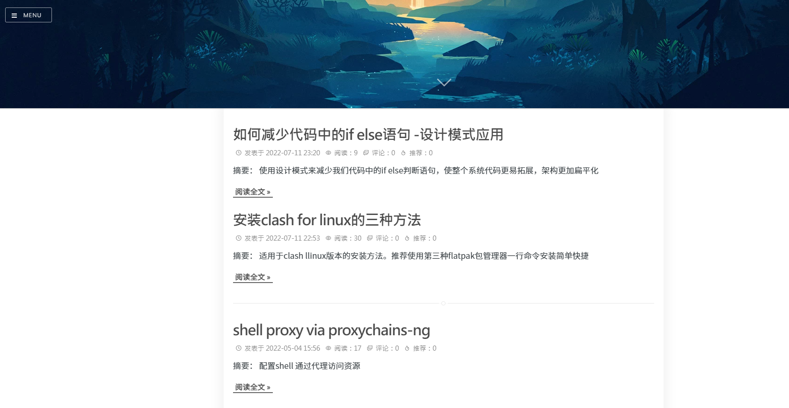

## 事件起因

在2022年初的时候，因为一直使用的有道云笔记出现同步错误问题（一台电脑上写的在另一个电脑始终无法同步过来），同时也想把自己的想法和平常遇到问题的解决方式分享给其他人，希望能够对别人有所帮助，于是有了创建自己博客的想法。

## 在cnblogs上创建博客

出于成本的考虑，自建博客需要在云服务上购买一系列的基础设施，还有要考虑日常运维等问题。博客嘛，肯定是内容为主，所以在目前国内非常成熟的博客园搭建了一套[自己的博客](https://www.cnblogs.com/gxhao)。稍微换了点主题，大概是长这样的：

看上去也很简单美观，而且编写也很方便，但是使用过程中也有一些小问题。

### markdown图片保存

在博客园写博客有个很难受的一点是，我刚开始使用有道云笔记作为博客的草稿。所以出现了一个问题，博客的草稿的图片非常难插入，本地markdown图片还好，上传到网页端因为链接消失的问题，图片需要能够在网页上访问。为此我尝试了各种办法：

1. 刚开始的时候使用的是利用有道云笔记的图片分享功能，大概是这样的[有道云笔记markdown插入图片方法 - 知乎 (zhihu.com)](https://zhuanlan.zhihu.com/p/149200483)。这样就导致我每次想往博客里面插入图片就很麻烦，而且还是重复性操作。

2. 后来又考虑使用[Home - AiurDrive (aiursoft.com)](https://drive.aiursoft.com/?show=direct)。这样也只需要上传图片到网站，然后引用即可。但是这种方式也存在因为某些原因网站偶尔无法访问导致链接失效和改变文件夹名称导致链接失效的问题，再去调整就很麻烦了。

### 资料展示灵活
有的时候想在博客上加一个别的栏目，或者别的功能，因为寄托于博客园本身的架构，像拓展的话很困难。

### 独立域名

虽然说访问博客园官网再加上自己主页的后缀访问起来也很方便，但是总是感觉隔一层怪怪的感觉。还是使用自己的域名访问更清真一些。

## 自建博客

### 申请域名

