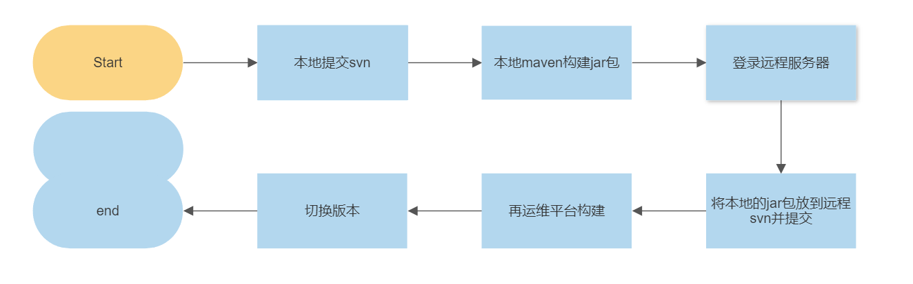
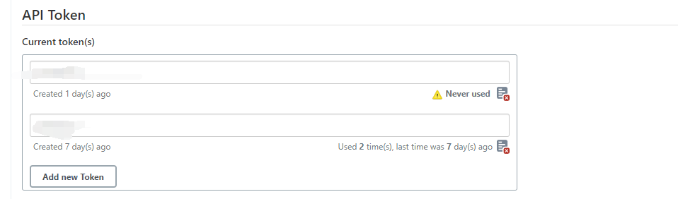
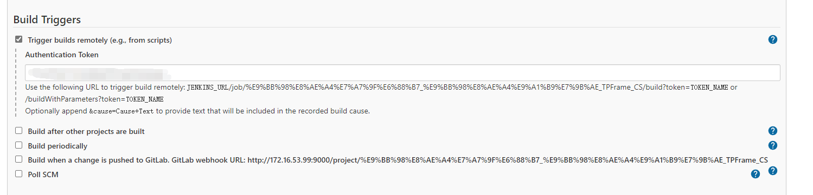
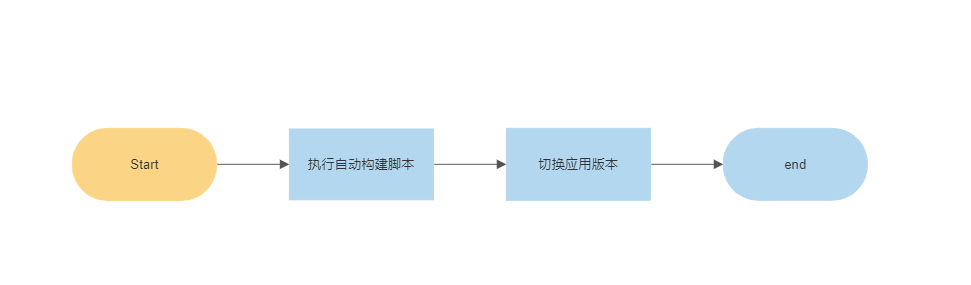

在我们项目开发过程中，由于生产开发svn地址和系统部署svn地址不一致，所以在我们开发完功能后，需要手动使用maven构建工具打包，然后登录到远程服务器，再将修改的包放到远程仓库的svn目录下，再提交，然后在运维平台构建，等待构建完成后再切换版本更新。

这一顿操作下来是不是听起来就感觉很麻烦了，但是如果是测试系统，这样的操作每天还要重复十多次。那这样的话我们的工作大部分时间都在重复性部署，**那这些重复性的工作**我们能不能交给计算机来做呢？

## 抽象

首先我们将这一过程抽象出来，大概是这样的：




## 设计

### 初始优化

刚开始我想的是把远程服务器的svn仓库拉到本地，然后本地构建完直接将文件移动到远程服务器远程svn仓库所在的文件夹。再点击提交，然后构建切换更新，这样就省去了登录服务器和复制文件这两个最耗时的操作（Windows服务器一般支持两个用户，所以会有登录到服务被人挤掉的情况，而且文件复制也很慢）。


代码实现就是这样的

```bash
set Path=%PATH%
set filePath=D:\work\xxxx\WEB-INF\lib
@echo start build
call mvn clean install -f pom.xml
@echo copy file
:: copy file
@echo copy jar file to eCloud directory
copy .\target\xxx.jar  %filePath%\xxx.jar


::提交到Jenkins
cd %filePath%
@echo svn commit
svn commit -m "测试系统更新"
```


### 进一步优化

省去登陆服务器的操作后，可以说为我们更新系统已经节省了很多部署构建时间。但是这样还有一个问题，那就是如果我项目中另一个开发人员加入这个项目，那么他还需要去把远程服务器的svn仓库拉下来，并且修改这个脚本。

虽然我们的工作量大大降低了，但是这个操作很明显增加了别人的工作量，所以还需要进一步对这个脚本进行优化。

我们应该提交到远程服务器文件夹，并且登陆到远程服务器执行提交命令，提交完返回后**自动触发运维平台**构建。

1. 关于自动触发运维平台。因为运维平台内部使用的是jenkins 构建部署工具。所以我们首先需要将jenkins应用所在服务器代理到nginx服务器，修改`nginx.conf`文件 

  ```
    		location / {
              proxy_connect_timeout 600s;
              proxy_read_timeout 600s;
              proxy_send_timeout 600s;
              proxy_pass http://xxx:9000;
              #root   html;
              #index  index.html index.htm;
          }
  ```

2. 配置Jenkins用户token。

   

3. 配置Jenkins触发事件

   

实现代码如下：

```ba
@echo off
set Path=%PATH%
::set filePath
set remotePath = /home/xxx
set jenkinsurl=xxx
set arg=%@urlencode[%jenkinsurl%]
@echo start build
call mvn clean install -f pom.xml
@echo copy file
:: copy file and run scriprt
@echo copy jar file to remote directory
scp .\target\xxxx.jar username@remoteip:/home/remotepath
::commit svn 
ssh -t username@remoteip  "  cd xxx/lib; svn commit -m 'CS update'; svn status; ls -l | grep  "
:: remote build
@echo post jenkins
curl -I -u username:password %tpframeurl%

@echo success job
pause


```


注意，该脚本需要事先将本地的rsa公钥放到authorized_keys文件中，保证ssh免密登陆服务器。

最终我们实现了这样的流程;



利用自动化脚本大大节约了我们的部署运维时间，可以更集中的专注于业务开发，提高我们的开发效率。

