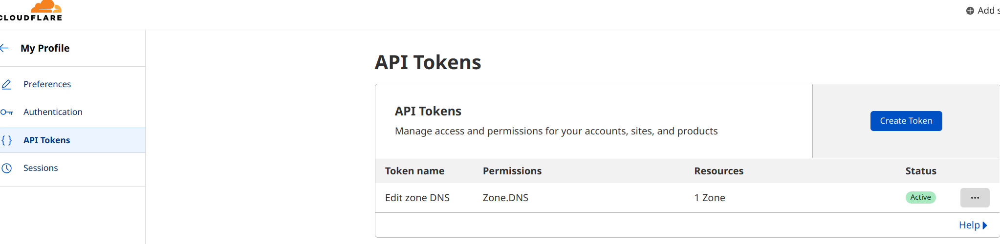

## 前置条件
- Linux系统或者可以装docker的路由器
- 域名
- [cloudflare](https://www.cloudflare.com/zh-cn/)账号

## 开整

### 1、创建配置文件
新建一个DDNS目录并创建`config.json`配置文件，文件内容如下

```
{
  "cloudflare": [
    {
      "authentication": {
        "api_token": "api_token_here",
        "api_key": {
          "api_key": "api_key_here",
          "account_email": "your_email_here"
        }
      },
      "zone_id": "your_zone_id_here",
      "subdomains": [
        {
          "name": "",
          "proxied": false
        },
        {
          "name": "remove_or_replace_with_your_subdomain",
          "proxied": false
        }
      ]
    }
  ],
  "a": true,
  "aaaa": true,
  "purgeUnknownRecords": false
}

```

参数说明：

**api_token**：
在cloudflare账户的[个人配置](https://dash.cloudflare.com/profile/api-tokens)中设置。

.、
**zone_id**:
在cloudflare账户的域名配置右下角Api下
**name**:
三级域名前缀，例如我想设置访问域名为**gxhao.xhaosoft.com**，这边设置为gxhao

### 2、 使用Docker-compose 运行
编写docekr-compose.yaml 文件。
```
version: '3.7'
services:
  cloudflare-ddns:
    image: timothyjmiller/cloudflare-ddns:latest
    container_name: cloudflare-ddns
    security_opt:
      - no-new-privileges:true
    network_mode: 'host'
    environment:
      - PUID=1000
      - PGID=1000
    volumes:
      - /YOUR/PATH/HERE/config.json:/config.json
    restart: unless-stopped
```
运行：
```
docker-compose up .
```

## 最后
大功告成，现在你可以在cloudflare中看到一条ip域名映射记录，并且每五分钟更新一次。现在你就可以使用你自定义的域名访问家里的设备了。

## 链接
> https://github.com/timothymiller/cloudflare-ddns